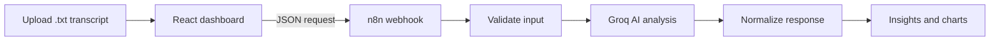

# ConverseIQ

> AI-powered conversation intelligence for customer-support transcripts.

ConverseIQ turns customer-support conversations into clear, evidence-backed insights. Upload a plain-text transcript to understand sentiment changes, escalation risk, resolution quality, customer satisfaction, empathy, business impact, and the moments that shaped the interaction.

## Features

- Overall and sentence-level sentiment analysis
- Customer satisfaction and escalation-risk indicators
- Resolution, empathy, and business-impact metrics
- Repeat-contact and follow-up predictions
- Key conversation moments with supporting evidence
- Sentiment recovery tracking
- Interactive charts and responsive dashboard
- Built-in sample analysis for testing without a backend
- Importable n8n workflow with structured AI output
- Secure server-side Groq authentication

## How It Works



The frontend sends the uploaded transcript to an n8n webhook. The workflow validates the request, calls Groq using a strict JSON schema, processes the response, and returns structured insights for the dashboard.

## Tech Stack

| Layer | Technology |
| --- | --- |
| Frontend | React 19, TypeScript, Vite |
| Styling | Tailwind CSS, shadcn/ui |
| Charts | Recharts |
| Automation | n8n |
| AI inference | Groq (`openai/gpt-oss-20b`) |
| Deployment | Vercel |

## Getting Started

### Prerequisites

- Node.js 22.13 or newer
- pnpm
- An n8n instance
- A Groq API key for live analysis

### Installation

Clone the repository:

```bash
git clone https://github.com/Nay1204/converse-Ai.git
cd converse-Ai
```

Install the dependencies:

```bash
pnpm install
```

Copy `.env.example` to `.env.local` and add your n8n webhook URL:

```env
VITE_N8N_WEBHOOK_URL=https://YOUR-N8N-HOST/webhook/converseiq-analyze
```

Start the development server:

```bash
pnpm dev
```

Open [http://localhost:5173](http://localhost:5173).

## Demo Login

```text
Email:    demo@converseiq.ai
Password: demo123
```

You can test the application using:

```text
public/sample-transcript.txt
```

## n8n Configuration

1. Create a **Header Auth** credential in n8n named `Groq API Key`.
2. Set the header name to `Authorization`.
3. Set its value to `Bearer YOUR_GROQ_API_KEY`.
4. Import `n8n/converseiq-workflow.json`.
5. Open the **Groq — Strict Analysis** node and select the credential.
6. Add `http://localhost:5173` to the Webhook node’s allowed origins.
7. Save and activate the workflow.
8. Copy the production webhook URL into `.env.local`.

For detailed instructions, see [`n8n/setup.md`](n8n/setup.md).

## API Request Format

```json
{
  "file_name": "support-call.txt",
  "transcript": "Agent: How can I help?\nCustomer: My connection is down."
}
```

The workflow returns:

```text
success
request_id
meta
data
```

## Available Commands

| Command | Purpose |
| --- | --- |
| `pnpm dev` | Start the development server |
| `pnpm build` | Create a production build |
| `pnpm preview` | Preview the production build |
| `pnpm lint` | Check the source code |
| `pnpm format` | Format the project |

## Project Structure

```text
├── src/                         # Screens, API client, types, and demo data
├── components/ui/               # Reusable UI components
├── app/globals.css              # Global styles
├── n8n/
│   ├── converseiq-workflow.json # Importable n8n workflow
│   ├── analysis-schema.json     # Structured output schema
│   ├── prompt.txt               # AI analysis prompt
│   └── setup.md                 # n8n setup guide
├── public/
│   └── sample-transcript.txt    # Sample test transcript
└── .env.example                 # Environment variable template
```

## Input Validation

- Only `.txt` files are accepted.
- Transcripts must contain between 50 and 15,000 characters.
- Analysis requests time out after 60 seconds.
- Invalid or incomplete backend responses are rejected.
- Sample results are available when the live workflow is not configured.

## Deployment

### Vercel

1. Import the GitHub repository into Vercel.
2. Keep the detected Vite build settings.
3. Add `VITE_N8N_WEBHOOK_URL` as an environment variable.
4. Add the Vercel domain to the n8n Webhook node’s allowed origins.
5. Deploy the application.

The included `vercel.json` provides the required single-page application fallback.

## Security and Privacy

- Keep the Groq API key inside an n8n credential.
- Never expose the Groq key through frontend environment variables.
- Do not commit `.env.local` or other secret files.
- Disable successful execution retention in n8n when transcript storage is unnecessary.
- The current login is a client-side demo gate, not production authentication.
- Add proper authentication before processing real customer data.

## Repository

[github.com/Nay1204/converse-Ai](https://github.com/Nay1204/converse-Ai)
